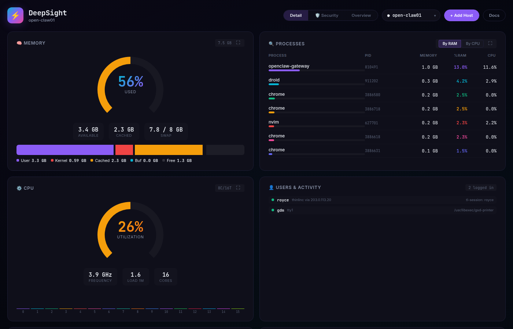
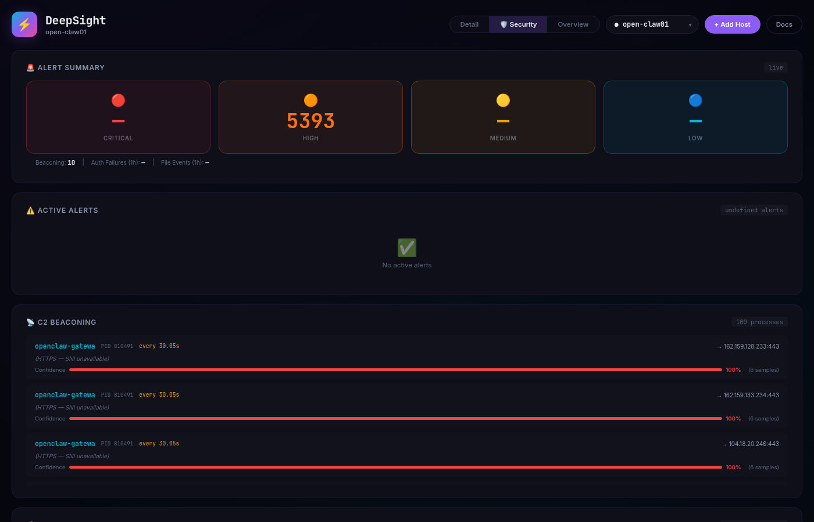

# 🛡️ DeepSight

> Real-time system monitoring, process forensics, and SIEM-level threat detection — across every Linux host in your fleet.

<p align="center">
  <a href="https://discord.gg/uzWJKDMRY"></a>
</p>

DeepSight is a lightweight, self-hosted dashboard that gives you observability into your servers. Monitor RAM, CPU, GPU, disk, and network usage in real time. Drill into individual processes with forensic detail. Track logged-in users and outbound HTTP connections. Detect reverse shells, C2 beaconing, brute force attacks, and file tampering — all from a single dark-mode dashboard.

<p align="center">
  
  
</p>

## ✨ Why DeepSight?

Most system monitors show you pretty graphs and stop there. DeepSight goes deeper:

- **🕵️ Process forensics** — click any process to see its full command line, memory map (PSS/USS/RSS), open file descriptors, child processes, environment variables, and network connections
- **📡 Multi-host** — deploy a lightweight Python agent to any Linux box with one command
- **🔒 SIEM detection** — real-time threat detection: reverse shells, C2 beaconing, SSH brute force, DNS/DGA, file integrity monitoring
- **🌐 Network visibility** — see every outbound HTTP/HTTPS connection with reverse DNS and owning process
- **🎮 GPU monitoring** — VRAM, utilization, temperature, clock speeds, power draw
- **📦 Zero dependencies on agents** — the agent works with just Python 3, no pip packages required
- **🎨 Dark, responsive UI** — built for production, looks great on desktop and mobile

## 📸 What You'll See

| Widget | Data |
|--------|------|
| 🧠 Memory | User, Kernel, Cached, Buffers, Free breakdown with PSI pressure |
| ⚙️ CPU | Per-core utilization, freq, temp, context switches, load averages |
| 💾 Disk | Usage bars, I/O throughput, IOPS, inode usage per volume |
| 🎮 GPU | VRAM, utilization, temperature, clock speeds, power draw |
| 🔍 Processes | Tabbed RAM/CPU tables, sortable columns, click-to-forensics |
| 👤 Users | Logged-in sessions with activity and source IP |
| 🌐 Network | TCP listeners, outbound HTTP connections with reverse DNS |
| 🛡️ Security | Active alerts, C2 beaconing, auth events, file integrity |

## 🚀 Quick Start

### Prerequisites

- **Collector host:** Linux with Python 3.8+, `pip`
- **Agent hosts:** Linux with Python 3 and systemd
- **Network:** Agents must be able to reach the collector over HTTPS (Tailscale recommended)

### Install

```bash
git clone https://github.com/R3dy/DeepSight.git
cd DeepSight
pip install flask psutil
python3 server.py
```

Open `http://localhost:8451` in your browser.

### Expose with Tailscale (recommended)

Add a Tailscale Serve route to get automatic TLS:

```bash
tailscale serve --bg 8451
```

Now access your dashboard at `https://<your-tailnet-name>:8451/`

## 📡 Add a Remote Host

On any Linux machine you want to monitor:

```bash
curl -sSL https://<your-collector>:8451/install.sh | sudo bash
```

The agent installs as a systemd service and starts reporting immediately. Check status:

```bash
systemctl status sysdash-agent
journalctl -u sysdash-agent -f
```

## 🛡️ Security Detection

DeepSight's SIEM engine runs five background collectors that continuously analyze your systems:

| Detector | What It Catches |
|----------|----------------|
| **Process Auditor** | Reverse shells (`bash -i >& /dev/tcp/...`, Python one-liners, netcat listeners), webshells, hidden cmdlines, executables from `/tmp` |
| **C2 Beaconing** | Periodic outbound HTTP patterns — flags beacon-like behavior when connection timing variance < 5% |
| **Auth Monitor** | SSH brute force (>5 failures/10s from same IP), sudo/su usage, account creation |
| **DNS Analyzer** | DGA domains via Shannon entropy scoring on resolved hostnames |
| **File Integrity** | Real-time monitoring of `/etc/passwd`, `/etc/shadow`, `/etc/sudoers`, `authorized_keys`, crontabs, and `/tmp` |

Every alert is tagged with MITRE ATT&CK technique mappings and severity levels.

### Alert Rules Reference

| Rule | Severity | MITRE Technique |
|------|----------|-----------------|
| SSH Brute Force | 🔴 Critical | T1110 (Brute Force) |
| Reverse Shell | 🔴 Critical | T1059 (Command & Scripting) |
| Web Server Spawn | 🔴 Critical | T1505 (Server Software) |
| C2 Beaconing | 🟠 High | T1071 (App Layer Protocol) |
| Hidden Cmdline | 🟠 High | T1564 (Hide Artifacts) |
| Process from /tmp | 🟠 High | T1204 (User Execution) |
| Sudoers Change | 🔴 Critical | T1548 (Abuse Elevation) |
| Auth Keys Change | 🔴 Critical | T1098 (Account Manipulation) |
| DGA Domain | 🟡 Medium | T1568 (Dynamic Resolution) |

## 🏗️ Architecture

```
┌──────────────┐     ┌──────────────┐
│  agent.py    │     │  agent.py    │    ← remote Linux hosts
│  (systemd)   │     │  (systemd)   │      curl | sudo bash
└──────┬───────┘     └──────┬───────┘
       │ POST /api/report    │
       │ (every 2s)          │
       ▼                     ▼
┌──────────────────────────────────────────────────────┐
│              Collector (Flask)                        │
│                                                      │
│  ┌──────────┐  ┌──────────┐  ┌──────────────────┐   │
│  │ In-Memory│  │ Network  │  │ Process Detail   │   │
│  │ HOSTS    │  │ Cache 5s │  │ Cache 3s/pid     │   │
│  └──────────┘  └──────────┘  └──────────────────┘   │
│                                                      │
│  ┌──────────────────────────────────────────────┐    │
│  │           Detection Engine (SIEM)            │    │
│  │  Process Audit · Beaconing · Auth · DNS · FIM│    │
│  │              ↓                               │    │
│  │         Alert Rules Engine                   │    │
│  │              ↓                               │    │
│  │         SQLite (alerts.db)                   │    │
│  └──────────────────────────────────────────────┘    │
│                                                      │
│  Data Sources: psutil, /proc, /sys, ss, auth.log     │
└──────────────────┬───────────────────────────────────┘
                   │ Tailscale Serve (HTTPS)
                   ▼
┌──────────────────────────────────────────────────────┐
│              Browser SPA                              │
│  Chart.js · Vanilla JS · Inter + JetBrains Mono      │
└──────────────────────────────────────────────────────┘
```

- **Metrics:** In-memory only (no time-series database required)
- **Alerts:** SQLite with WAL mode (auto-created)
- **Frontend:** Single HTML file, zero build step

## 📡 Remote Agent

The agent (`agent.py`) is designed to work anywhere:

- **Primary path:** Uses `psutil` for rich metrics
- **Fallback path:** Pure `/proc` and `/sys` parsing — zero dependencies beyond Python 3
- **Transport:** HTTP POST with shared-secret authentication
- **Lifecycle:** systemd service, auto-restart on failure
- **Host lifecycle:** Online → Stale (15s) → Pruned (60s)

### Customize

Edit `/opt/sysdash-agent/config.json`:

```json
{
    "collector_url": "https://your-collector:8451",
    "secret": "your-shared-secret",
    "host": "my-server-name",
    "interval": 2
}
```

Or override via CLI:

```bash
python3 agent.py --host staging-box --collector https://192.168.1.100:8451 --secret my-key --interval 5
```

## 🔧 Configuration

| Env Variable | Default | Description |
|-------------|---------|-------------|
| `DASHBOARD_SECRET` | `sysdash-agent-key-2026` | Shared secret for agent authentication |

## 🤖 AI Agent Context

This repo includes `AGENTS.md` and `LLMs.txt` files for AI coding agents. They provide architecture overview, type shapes, function references, and design constraints to help LLMs work effectively with the codebase.

## 📚 Documentation

Full docs available at `/docs/` (VitePress):

```bash
npm run docs:dev      # start docs dev server
npm run docs:build    # build static docs
```

## ⚠️ Limitations

- **No persistent metric history** — stats live in memory, lost on restart (alerts are persisted)
- **Single collector** — no federation or failover
- **Linux only** — collector and agent require `/proc` and `/sys`
- **Auth log monitoring** — collector-only (agents don't ship auth.log)

## 📄 License

MIT
